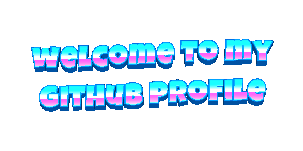

  
<!--   
    -->

#  Hello, I am

  <h1>
    
  </h1>

  

## 🚀 About Me

<table border = "0">
<tr>
<td width = "50%" valign = "top">
  
**💫 Developer Profile**

 <b> Role: </b> Master's Student 

 <b> Location: </b> India 

 <b> Experience: </b> Loading... 

 <b> Passion: </b> Coding and Mathematics 

 <b> Current Focus: </b> Researching on topics related to Artificial Intelligence and Machine Learning. 

 <b> Guiding Pronciples: </b> When the going gets tough, the tough gets going. 

</td>
<td width = "50%" valign = "top">

</td>
</tr>
</table>

 
 

  
   
   

<!--
## Hi there 👋

**coolrishi28/coolrishi28** is a ✨ _special_ ✨ repository because its `README.md` (this file) appears on your GitHub profile.

Here are some ideas to get you started:

- 🔭 I’m currently working on ...
- 🌱 I’m currently learning ...
- 👯 I’m looking to collaborate on ...
- 🤔 I’m looking for help with ...
- 💬 Ask me about ...
- 📫 How to reach me: ...
- 😄 Pronouns: ...
- ⚡ Fun fact: ...
-->
